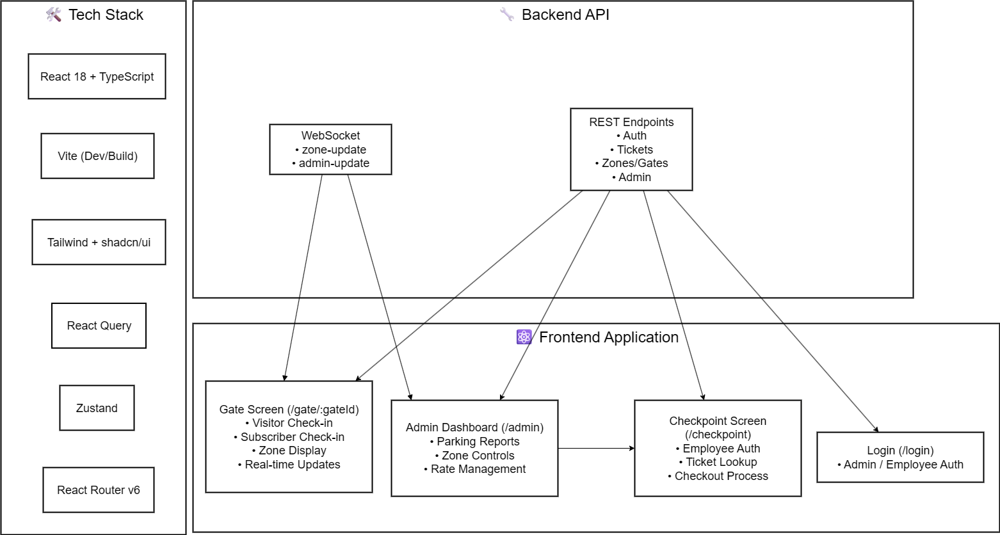

# Frontend Architecture - Parking Reservation System

## Overview

This document outlines the frontend architecture for the Parking Reservation System, a real-time administrative application with three main user interfaces: Gate Check-in, Employee Checkpoint, and Admin Dashboard.

## System Architecture Diagram



_The diagram above shows the overall system architecture, data flow, and component relationships with clean visual hierarchy and professional styling._

## Architecture Decisions

### 1. Framework Choice: React + Vite vs Next.js

**Decision: React + Vite**
Okin par
**Rationale:**

- **Internal Admin Tool**: This is not a public-facing website requiring SEO or server-side rendering
- **Real-time Focus**: Heavy WebSocket usage is simpler in client-side applications
- **Development Speed**: 5-day timeline requires fastest possible development cycle
- **Deployment Simplicity**: Static build can be deployed anywhere (Vercel, Netlify, S3)
- **Bundle Efficiency**: No unnecessary Next.js overhead for features we won't use

**Trade-offs Considered:**

- ✅ Faster development and hot reload
- ✅ Simpler authentication (JWT in storage)
- ✅ Better WebSocket integration
- ❌ Manual routing setup (acceptable for 4-5 routes)
- ❌ No built-in API routes (we have separate backend)

### 2. Tech Stack

| Layer                | Technology               | Rationale                                    |
| -------------------- | ------------------------ | -------------------------------------------- |
| **Framework**        | React 18 + Vite          | Fast dev experience, perfect for admin tools |
| **Routing**          | React Router v6          | Industry standard, supports lazy loading     |
| **Styling**          | Tailwind CSS + shadcn/ui | Rapid development, consistent design system  |
| **State Management** | Zustand + React Query    | Minimal global state + powerful server state |
| **Forms**            | React Hook Form + Zod    | Performance + type-safe validation           |
| **Icons**            | Lucide React             | Consistent, modern icon set                  |
| **Real-time**        | Native WebSocket         | Simple, minimal overhead                     |

## Architecture Patterns

### 3. Folder Structure

```
src/
├── components/           # Reusable UI components
│   ├── ui/              # shadcn/ui base components
│   ├── layout/          # Layout components (Header, Sidebar)
│   ├── forms/           # Form components
│   └── shared/          # Cross-feature components
├── features/            # Feature-based organization
│   ├── auth/            # Authentication logic
│   ├── gate/            # Gate check-in feature
│   ├── checkpoint/      # Employee checkout feature
│   └── admin/           # Admin dashboard feature
├── hooks/               # Custom React hooks
├── lib/                 # Utilities and configurations
│   ├── api.ts           # API service layer
│   ├── websocket.ts     # WebSocket management
│   ├── auth.ts          # Auth utilities
│   └── utils.ts         # General utilities
├── store/               # Global state management
│   ├── auth-store.ts    # Authentication state
│   └── ui-store.ts      # UI preferences
├── types/               # TypeScript type definitions
└── App.tsx              # Root component
```

**Why Feature-based Structure:**

- Each feature (`gate`, `checkpoint`, `admin`) has distinct user flows
- Easier to maintain and scale individual features
- Clear separation of concerns
- Better code organization for team development

### 4. State Management Strategy

#### Server State (React Query)

- **API calls and caching**: All backend communication
- **Background updates**: Automatic refetching and cache invalidation
- **Loading and error states**: Built-in UI state management
- **WebSocket integration**: Cache updates from real-time events

```typescript
// Example: Zone data with automatic updates
const { data: zones, isLoading } = useQuery({
  queryKey: ["zones", gateId],
  queryFn: () => api.getZones(gateId),
  staleTime: 30000, // 30s cache
});
```

#### Client State (Zustand)

- **Authentication state**: User info, tokens, permissions
- **UI preferences**: Theme, selected gate, modal states
- **WebSocket connection**: Connection status, subscription state

```typescript
// Minimal global state
interface AppState {
  auth: { user: User | null; token: string | null };
  ui: { selectedGate: string | null; theme: "light" | "dark" };
  ws: { connected: boolean; subscriptions: Set<string> };
}
```

### 5. Component Design Patterns

#### Composition over Inheritance

```typescript
// Good: Composable components
<GateScreen gateId={gateId}>
  <GateHeader />
  <ZoneGrid>
    {zones.map((zone) => (
      <ZoneCard key={zone.id} zone={zone} onSelect={handleSelect} />
    ))}
  </ZoneGrid>
</GateScreen>
```

#### Custom Hooks for Logic

```typescript
// Encapsulate feature logic in hooks
const useGateFlow = (gateId: string) => {
  const [selectedZone, setSelectedZone] = useState<Zone | null>(null);
  const checkinMutation = useMutation({ ... });

  return {
    selectedZone,
    setSelectedZone,
    handleCheckin: checkinMutation.mutate,
    isLoading: checkinMutation.isLoading,
  };
};
```

#### Error Boundaries per Feature

```typescript
<ErrorBoundary fallback={<ErrorFallback />}>
  <GateFeature />
</ErrorBoundary>
```

### 6. Data Flow Architecture

#### API Layer Design

```typescript
// Centralized API service
class ApiService {
  private baseURL = "http://localhost:3000/api/v1";

  async post<T>(endpoint: string, data: any): Promise<T> {
    // Centralized error handling, auth headers, etc.
  }
}

// React Query integration
export const useCheckin = () => {
  return useMutation({
    mutationFn: (data: CheckinRequest) => api.post("/tickets/checkin", data),
    onSuccess: (response) => {
      // Update zone cache
      queryClient.setQueryData(["zones", response.zoneId], response.zoneState);
    },
  });
};
```

#### WebSocket Integration

```typescript
// WebSocket state updates React Query cache
websocket.on("zone-update", (payload) => {
  queryClient.setQueryData(["zones", payload.gateId], (old) =>
    old?.map((zone) => (zone.id === payload.id ? payload : zone))
  );
});
```

### 7. Real-time Architecture

#### WebSocket Connection Management

- **Single connection** per client
- **Automatic reconnection** with exponential backoff
- **Subscription management** by gate/feature
- **Cache synchronization** with React Query

```typescript
class WebSocketManager {
  private ws: WebSocket | null = null;
  private subscriptions = new Set<string>();

  subscribe(gateId: string) {
    this.subscriptions.add(gateId);
    this.send({ type: "subscribe", payload: { gateId } });
  }

  onMessage(event: MessageEvent) {
    const message = JSON.parse(event.data);
    switch (message.type) {
      case "zone-update":
        // Update React Query cache
        break;
      case "admin-update":
        // Trigger UI notifications
        break;
    }
  }
}
```

### 8. Security Considerations

#### Authentication Flow

- **JWT tokens** stored in localStorage (acceptable for admin tools)
- **Protected routes** with React Router
- **Automatic token refresh** (if backend supports it)
- **Role-based access** (admin vs employee)

#### API Security

- **Authorization headers** on all protected requests
- **Input validation** with Zod schemas
- **XSS prevention** by avoiding dangerouslySetInnerHTML

### 9. Performance Strategy

#### Code Splitting

```typescript
// Lazy load features
const GatePage = lazy(() => import("./features/gate/GatePage"));
const CheckpointPage = lazy(
  () => import("./features/checkpoint/CheckpointPage")
);
const AdminPage = lazy(() => import("./features/admin/AdminPage"));
```

#### Optimization Patterns

- **React.memo** for expensive zone cards
- **useMemo** for computed zone availability
- **useCallback** for event handlers passed to lists
- **React Query caching** reduces API calls

### 10. Error Handling Strategy

#### Layered Error Handling

1. **Network Level**: API service catches and formats errors
2. **Query Level**: React Query handles loading/error states
3. **Component Level**: Error boundaries catch render errors
4. **User Level**: Toast notifications for user actions

```typescript
// Consistent error display
const { data, error, isLoading } = useQuery({
  queryKey: ["zones"],
  queryFn: fetchZones,
  onError: (error) => {
    toast.error(`Failed to load zones: ${error.message}`);
  },
});
```

### 11. Testing Strategy

#### Testing Pyramid for 5-day Timeline

- **Unit Tests**: Critical business logic hooks and utilities
- **Integration Tests**: Key user flows (checkin, checkout)
- **E2E Tests**: One happy path per feature (if time allows)

```typescript
// Example: Testing custom hooks
test("useGateFlow handles zone selection", () => {
  const { result } = renderHook(() => useGateFlow("gate_1"));

  act(() => {
    result.current.setSelectedZone(mockZone);
  });

  expect(result.current.selectedZone).toBe(mockZone);
});
```

### 12. Deployment Architecture

#### Static Build Deployment

- **Build**: `npm run build` creates optimized static files
- **Deploy**: Upload `dist/` to any static hosting
- **Environment**: Use `.env` files for API endpoints
- **CI/CD**: Simple build and deploy pipeline

## Implementation Roadmap

### Day 1: Foundation

- ✅ Project setup and dependencies
- 🔄 Basic routing and layout
- 🔄 Authentication service and store
- 🔄 API service layer

### Day 2: Gate Feature

- Zone display and selection
- Visitor check-in flow
- Subscriber check-in flow
- WebSocket connection

### Day 3: Checkpoint Feature

- Employee authentication
- Ticket lookup and checkout
- Breakdown display
- Convert to visitor flow

### Day 4: Admin Feature

- Dashboard layout
- Parking state reports
- Zone controls (open/close)
- Rate management

### Day 5: Integration & Polish

- WebSocket integration across features
- Error handling and loading states
- Basic tests and documentation
- UI polish and responsive design

## Key Success Metrics

1. **Functional**: All required user flows work against provided backend
2. **Real-time**: WebSocket updates reflect immediately in UI
3. **Code Quality**: Clean, maintainable, well-structured code
4. **Performance**: Fast load times, responsive interactions
5. **User Experience**: Clear UI states, good error handling

## Conclusion

This architecture prioritizes **speed of development** and **maintainability** for a 5-day timeline while establishing patterns that could scale to a larger application. The choices favor proven, simple solutions over complex optimizations that aren't needed for this use case.

The feature-based organization and clear separation between server state (React Query) and client state (Zustand) should make the codebase easy to understand and extend.
