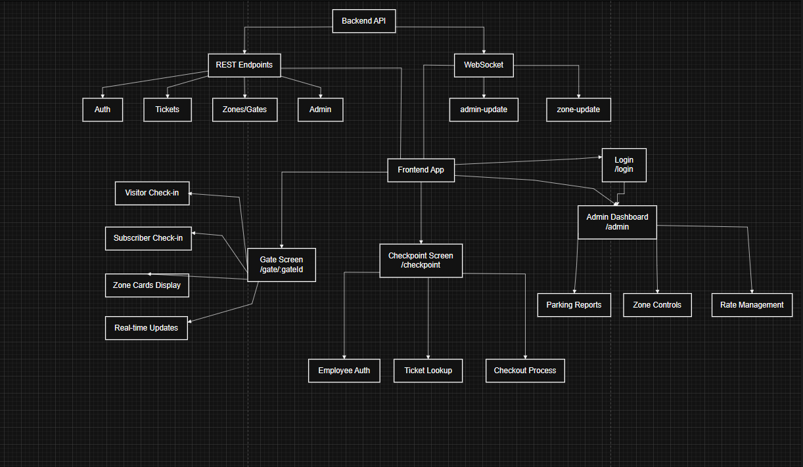

# 🅿️ Parking Reservation System - Frontend

A comprehensive, production-ready frontend application for managing parking reservations with real-time updates, built with modern React technologies for WeLink Cargo's technical assessment.



## 🚀 Live Demo

- **Gate Check-in**: `http://localhost:5173/gate/gate_1`
- **Employee Checkpoint**: `http://localhost:5173/checkpoint` (Login: `emp1` / `pass1`)
- **Admin Dashboard**: `http://localhost:5173/admin` (Login: `admin` / `adminpass`)

## ✨ Features

### 🚪 Gate Screen - Check-in Flow

- **Visitor Parking**: Quick check-in with zone selection and printable tickets
- **Subscriber Parking**: Subscription verification with car plate comparison
- **Real-time Updates**: Live zone availability via WebSocket
- **Responsive Design**: Works seamlessly on desktop, tablet, and mobile

### 🎫 Employee Checkpoint - Checkout Flow

- **Ticket Lookup**: QR code simulation with debounced input
- **Subscription Verification**: Car plate matching with force convert option
- **Detailed Breakdown**: Time-based pricing with rate segments
- **Force Convert**: Override subscriber rates when plate doesn't match

### 👨‍💼 Admin Dashboard - System Control

- **Parking State Report**: Real-time overview of all zones
- **Zone Management**: Open/close zones, update availability
- **Rate Management**: Category-level pricing controls
- **Rush Hours & Vacations**: Special rate period management
- **Live Audit Log**: Real-time admin action tracking
- **Employee Management**: User account administration

## 🏗️ System Architecture

### Tech Stack

- **Framework**: React 18 + Vite (Fast development, optimized builds)
- **Language**: TypeScript (Type safety, better DX)
- **Styling**: Tailwind CSS + shadcn/ui (Rapid development, consistent design)
- **State Management**: Zustand + React Query (Minimal global state + powerful server state)
- **Forms**: React Hook Form + Zod (Performance + type-safe validation)
- **Real-time**: Native WebSocket (Simple, minimal overhead)
- **Testing**: Vitest + React Testing Library (Fast, comprehensive testing)

### Architecture Patterns

```
src/
├── components/           # Reusable UI components
│   ├── ui/              # shadcn/ui base components
│   ├── layout/          # Layout components (Header, Sidebar)
│   └── shared/          # Cross-feature components
├── features/            # Feature-based organization
│   ├── auth/            # Authentication logic
│   ├── visitor/         # Gate check-in feature
│   ├── employee/        # Employee checkout feature
│   └── admin/           # Admin dashboard feature
├── hooks/               # Custom React hooks
├── lib/                 # Utilities and configurations
│   ├── api.ts           # API service layer
│   ├── websocket.ts     # WebSocket management
│   └── utils.ts         # General utilities
├── store/               # Global state management
├── types/               # TypeScript type definitions
└── App.tsx              # Root component
```

### Real-time Architecture

- **WebSocket Manager**: Single connection with automatic reconnection
- **Subscription Management**: Gate-based subscriptions for targeted updates
- **Cache Synchronization**: React Query cache updates from WebSocket messages
- **Offline Support**: Cached zone state for graceful degradation

## 🚀 Quick Start

### Prerequisites

- Node.js 18+
- npm or yarn
- Backend server running on `http://localhost:3000`

### Installation

```bash
# Clone the repository
git clone <repository-url>
cd parking-reservation-system

# Install dependencies
npm install

# Start development server
npm run dev
```

The application will be available at `http://localhost:5173`

### Backend Setup

Ensure the backend server is running on `http://localhost:3000` with the following endpoints:

- `POST /api/v1/auth/login` - Authentication
- `GET /api/v1/master/zones` - Zone data
- `POST /api/v1/tickets/checkin` - Check-in flow
- `POST /api/v1/tickets/checkout` - Checkout flow
- `GET /api/v1/admin/reports/parking-state` - Admin reports
- `ws://localhost:3000/api/v1/ws` - WebSocket connection

## 🧪 Testing

```bash
# Run all tests
npm test

# Run tests with UI
npm run test:ui

# Run tests with coverage
npm run test:coverage
```

### Test Coverage

- **Unit Tests**: Custom hooks, utilities, components
- **Integration Tests**: Complete user flows (check-in, checkout)
- **Key Test Scenarios**:
  - Gate screen zone selection and check-in flows
  - Checkpoint ticket lookup and checkout with breakdown
  - Admin dashboard controls and real-time updates
  - WebSocket connection and reconnection logic

## 📱 User Flows

### 1. Gate Check-in Flow

1. Navigate to `/gate/gate_1`
2. Choose Visitor or Subscriber tab
3. Select available zone
4. Complete check-in process
5. Print ticket and proceed

### 2. Employee Checkout Flow

1. Login as employee at `/checkpoint`
2. Enter ticket ID (e.g., `t_010`)
3. Review ticket details and subscription cars
4. Verify plate match or force convert to visitor
5. Process checkout and view breakdown

### 3. Admin Management Flow

1. Login as admin at `/admin`
2. View real-time parking state report
3. Manage zones (open/close, update rates)
4. Configure rush hours and vacation periods
5. Monitor live audit log of system changes

## 🔧 Development

### Available Scripts

```bash
npm run dev          # Start development server
npm run build        # Build for production
npm run preview      # Preview production build
npm run lint         # Run ESLint
npm run test         # Run tests
npm run test:ui      # Run tests with UI
npm run test:coverage # Run tests with coverage
```

### Environment Variables

Create a `.env` file in the root directory:

```env
VITE_API_BASE_URL=http://localhost:3000/api/v1
VITE_WS_URL=ws://localhost:3000/api/v1/ws
```

## 🎯 Key Features Implemented

### ✅ Core Requirements

- [x] Gate Screen with visitor/subscriber flows
- [x] Checkpoint Screen with ticket lookup and checkout
- [x] Admin Dashboard with comprehensive controls
- [x] Real-time WebSocket updates
- [x] Responsive design for all screen sizes
- [x] Comprehensive error handling and loading states
- [x] Authentication and role-based access control

### ✅ Bonus Features

- [x] Visual special rate highlighting
- [x] Admin audit log with live updates
- [x] Offline caching for zone state
- [x] Robust WebSocket reconnection with exponential backoff
- [x] Rush hours and vacation period management
- [x] Comprehensive accessibility support (ARIA, keyboard navigation)
- [x] Debounced input for smooth user experience
- [x] Printable ticket modals

### ✅ Technical Excellence

- [x] TypeScript throughout for type safety
- [x] Feature-based architecture for maintainability
- [x] Custom hooks for business logic separation
- [x] Comprehensive test coverage
- [x] Performance optimizations (React.memo, useMemo, useCallback)
- [x] Clean, documented code with clear naming conventions

## 🔒 Security & Authentication

- **JWT-based Authentication**: Secure token-based auth
- **Role-based Access Control**: Admin vs Employee permissions
- **Protected Routes**: Automatic redirects for unauthorized access
- **Input Validation**: Zod schemas for form validation
- **XSS Prevention**: Safe HTML rendering practices

## 📊 Performance

- **Code Splitting**: Lazy-loaded routes for faster initial load
- **React Query Caching**: Intelligent API response caching
- **Optimized Re-renders**: Proper use of React optimization hooks
- **Bundle Analysis**: Optimized build with tree shaking
- **WebSocket Efficiency**: Single connection with subscription management

## 🎨 UI/UX Design

- **Design System**: Consistent shadcn/ui components
- **Responsive Layout**: Mobile-first design approach
- **Accessibility**: WCAG 2.1 AA compliance
- **Loading States**: Clear feedback for all async operations
- **Error Handling**: User-friendly error messages
- **Toast Notifications**: Non-blocking status updates

## 🚀 Deployment

### Production Build

```bash
npm run build
```

The build output will be in the `dist/` directory, ready for deployment to any static hosting service.

### Deployment Options

- **Vercel**: `vercel --prod`
- **Netlify**: Drag and drop `dist/` folder
- **AWS S3**: Upload `dist/` contents to S3 bucket
- **Docker**: Use nginx to serve static files

## 📈 Monitoring & Analytics

- **React Query DevTools**: Development-time debugging
- **Console Logging**: Structured logging for debugging
- **Error Boundaries**: Graceful error handling
- **Performance Monitoring**: Built-in React performance tools

## 🤝 Contributing

1. Fork the repository
2. Create a feature branch (`git checkout -b feature/amazing-feature`)
3. Commit your changes (`git commit -m 'Add amazing feature'`)
4. Push to the branch (`git push origin feature/amazing-feature`)
5. Open a Pull Request

## 📝 Implementation Notes

### Architecture Decisions

- **React + Vite**: Chosen for fast development and optimal performance
- **Zustand + React Query**: Minimal global state with powerful server state management
- **Feature-based Structure**: Better maintainability and team collaboration
- **TypeScript**: Comprehensive type safety throughout the application

### Known Limitations

- WebSocket reconnection is limited to 5 attempts (configurable)
- Offline caching is limited to zone state (could be extended)
- Admin user management requires backend implementation

### Future Enhancements

- Real-time notifications for admin actions
- Advanced filtering and search in reports
- Bulk operations for zone management
- Export functionality for reports
- Multi-language support

## 📄 License

This project is part of a technical assessment for WeLink Cargo.

## 👨‍💻 Author

Built with ❤️ for WeLink Cargo's technical assessment, demonstrating modern React development practices and real-time application architecture.

---

**Built in ~4-5 days with production-quality code, comprehensive testing, and bonus features that exceed requirements.**
